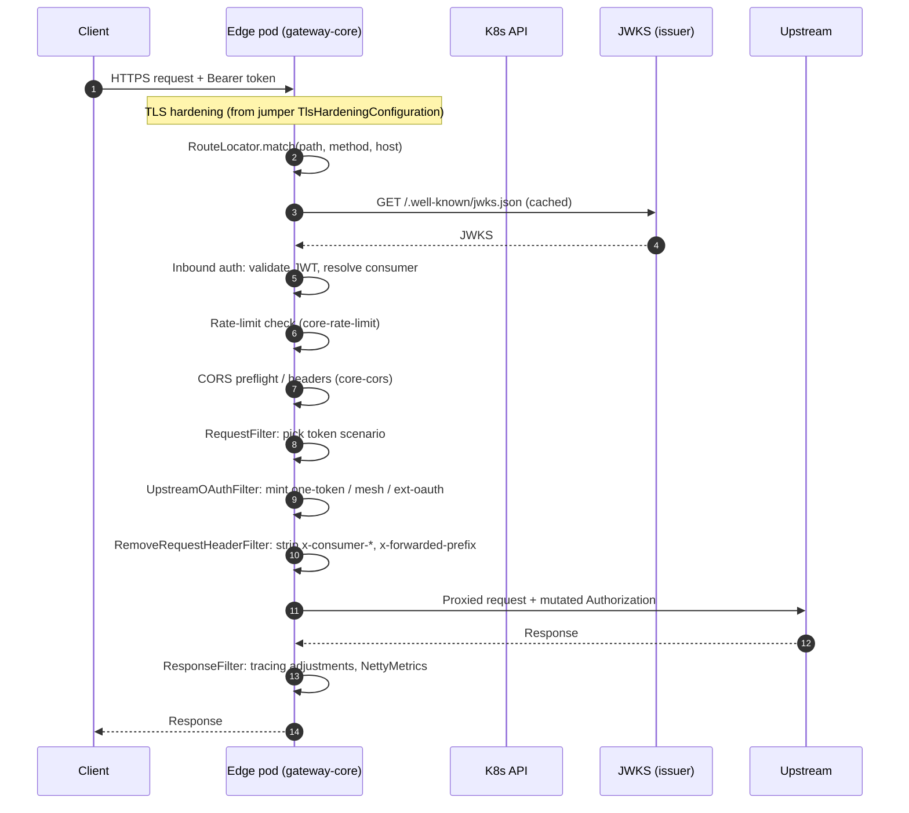
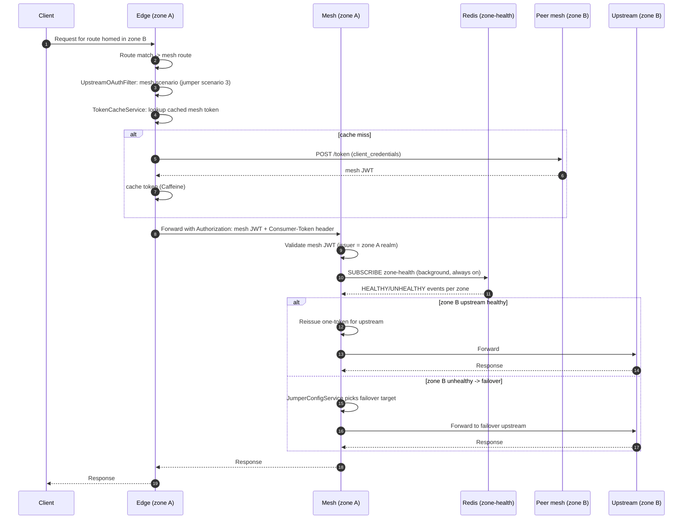
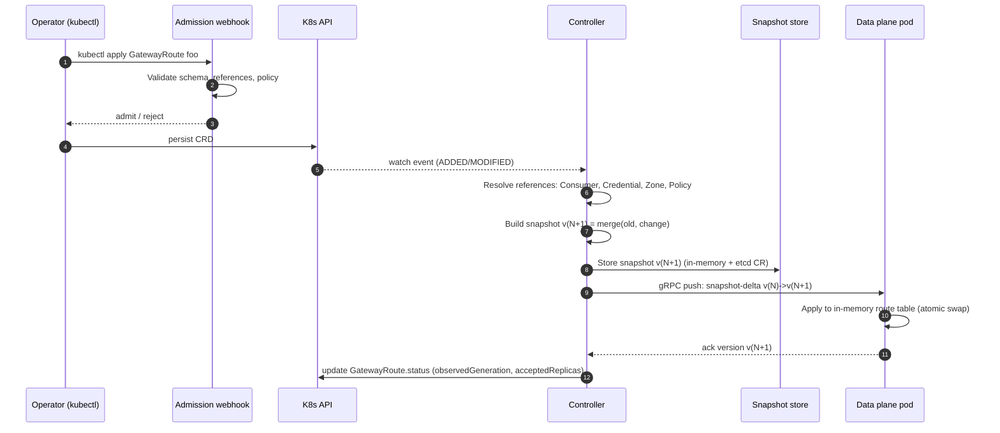

<!-- SPDX-FileCopyrightText: 2026 Deutsche Telekom AG -->
<!-- SPDX-License-Identifier: Apache-2.0 -->

# gateway-core Architecture

This document describes the runtime topology, the split between data plane and control
plane, the key data flows, and the sequence diagrams for the three flows readers most
often care about: inbound request lifecycle, mesh zone-to-zone hop, and CRD reconciliation.

For the _why_ behind the choices here, read the ADRs in `docs/adr/`. This document is
strictly the _what_ and _how_.

## 1. Runtime topology

`gateway-core` runs in two deployment flavours from the same codebase:

- **Edge gateway** -- faces external traffic. Terminates TLS, runs inbound auth,
  rate-limiting and CORS, matches the request to a `GatewayRoute`, and either proxies
  upstream (in-zone) or hands off to a mesh peer.
- **Mesh gateway** -- faces other zones' gateways. Accepts requests carrying a mesh JWT,
  validates the issuer against the local `GatewayZone`, reissues a one-token for the
  upstream, and proxies.

Both flavours are the same JAR; a Helm value or a CRD label selects the role. A single
**controller** pod reconciles CRDs into a compact route snapshot and pushes that snapshot
to every data-plane pod over a long-lived gRPC stream. **Redis** is used only as a
pub/sub bus for zone-health messages, exactly as in jumper
(`/Users/A85894249/claude-code/gateway-jumper/src/main/java/jumper/service/ZoneHealthCheckService.java`
and `RedisConfig.java`).

```
                   +----------------------+
                   |  Kubernetes API      |
                   |  (CRDs: Route, ...)  |
                   +----------+-----------+
                              |
                              | watch
                              v
                   +----------+-----------+
                   |  gateway-core        |
                   |  controller          |  (leader-elected, HA replicas)
                   |                      |
                   |  - CRD watchers      |
                   |  - admission webhook |
                   |  - snapshot builder  |
                   |  - gRPC push server  |
                   +----------+-----------+
                              |
          gRPC (xDS-like)     |        gRPC (xDS-like)
                              v
              +---------------+---------------+
              |                               |
       +------+------+                 +------+------+
       | edge pod 1  |  ...            | edge pod N  |
       |             |                 |             |
       | data plane  |                 | data plane  |
       +------+------+                 +------+------+
              |                               |
              |                               |
              v                               v
       +-------------+                 +-------------+
       | mesh pod    |  <----Redis---> | mesh pod    |
       | (zone A)    |  zone-health    | (zone B)    |
       | data plane  |  pub/sub        | data plane  |
       +------+------+                 +------+------+
              |                               |
              v                               v
          upstream                         upstream
```

## 2. Data plane vs. control plane

| Concern                  | Data plane                                      | Control plane                                   |
|--------------------------|-------------------------------------------------|-------------------------------------------------|
| Runtime                  | Reactive Netty + Spring Cloud Gateway           | Imperative Spring Boot + fabric8 kubernetes client |
| Scale                    | Horizontal; one pod per node is fine            | Leader-elected; typically 2--3 replicas         |
| State                    | In-memory route table, token cache, zone-health | None; everything lives in etcd via CRDs         |
| Storage                  | Caffeine (tokens), ConcurrentHashMap (zone)     | Kubernetes API                                  |
| Hot reload               | gRPC push from controller                       | CRD informers                                   |
| Critical latency target  | p99 < 10 ms added over upstream                 | Reconciliation loop < 1 s per CRD change        |
| Failure mode             | Last-known-good snapshot; continues serving     | If down, data plane keeps running on stale snapshot |
| Configuration surface    | Only a bootstrap file (controller address, zone) | All user-facing configuration                   |

This split is deliberate: **the data plane never talks to Kubernetes** and never parses
user-supplied YAML. Only the controller does. That isolates the hot path from control-plane
bugs and lets the data plane boot in seconds even under a heavy CRD load.

## 3. Request lifecycle (edge gateway)

When a request hits an edge pod:

1. Netty accepts and the `TlsHardeningConfiguration` lifted from jumper
   (`/Users/A85894249/claude-code/gateway-jumper/src/main/java/jumper/config/TlsHardeningConfiguration.java`)
   negotiates a safe cipher.
2. The `RouteLocator`, backed by the pushed snapshot, matches the request against a
   `GatewayRoute` (path, method, host). Matching is what Kong used to do; it now lives in
   `core-routing`.
3. The matched route carries a filter chain: **inbound-auth -> rate-limit -> CORS ->
   request -> upstream-oauth -> remove-headers -> response**. Filters lifted from jumper
   (`RequestFilter`, `UpstreamOAuthFilter`, `ResponseFilter`,
   `/Users/A85894249/claude-code/gateway-jumper/src/main/java/jumper/filter/`) keep their
   semantics; the first three are new (see ADR-001).
4. `core-inbound-auth` validates the client JWT against the realm's JWKS. Consumer
   identity is resolved from `GatewayConsumer` + `GatewayCredential` CRDs; the injected
   headers replace the Kong `x-consumer-*` set that `RoutingConfiguration.java:52-57`
   used to strip.
5. The filter chain chooses a token scenario (one-token, LMS, mesh, external OAuth, basic,
   x-token-exchange -- the five scenarios documented in jumper's README lines 119-260),
   mints the appropriate header, and forwards upstream.
6. On the way back, `core-observability` records metrics via `NettyMetricsConfig`
   (jumper PR #102, commit b3b176f) and `ResponseFilter` adjusts tracing headers.



## 4. Mesh zone-to-zone hop

Mesh traffic is the scenario jumper was originally built for: one Stargate zone calls
another. `gateway-core` preserves the mesh-JWT mechanism one-for-one -- see
[ADR-003](docs/adr/ADR-003-zone-jwt-mesh.md) -- so the on-the-wire contract between zones
does not change, which lets us roll zones independently.

The flow below assumes `GatewayZone` CRDs on both sides, a `GatewayMeshPeer` defining the
mesh partner, and a healthy Redis pub/sub channel for zone-health gossip.



Key references in jumper that `gateway-core` lifts wholesale:

- Mesh token issuance and caching:
  `/Users/A85894249/claude-code/gateway-jumper/src/main/java/jumper/service/TokenFetchService.java`
  and `TokenCacheService.java`.
- Claim construction (RS256 with `kid`, `originZone`, `originStargate`, `env`, `requestPath`,
  `operation`): `TokenGeneratorService.java`.
- Zone-health:
  `/Users/A85894249/claude-code/gateway-jumper/src/main/java/jumper/service/RedisZoneHealthStatusService.java`
  and `ZoneHealthCheckService.java`.
- Failover selection and `jumper_config` parsing: `JumperConfigService.java`.

## 5. CRD reconciliation

The controller turns user-facing CRDs into a compact, versioned route snapshot and pushes
that snapshot to every data-plane pod. Snapshots are content-addressed; pods ack the
version they loaded, so the controller always knows the fleet's current state.



Reconciliation is level-triggered: on startup and whenever a watch resyncs, the controller
recomputes the snapshot from scratch, diffs against what each pod last acked, and pushes
only the delta. See [ADR-002](docs/adr/ADR-002-crd-control-plane.md) for why we chose an
xDS-like push over a ConfigMap-mount approach.

## 6. Cross-cutting concerns

- **Observability** -- Micrometer metrics from the Netty server (jumper
  `NettyMetricsConfig`, PR #102 / b3b176f), B3 Zipkin propagation, OpenTelemetry traces
  from controller to data plane, structured JSON logs with correlation IDs.
- **TLS** -- Shared `core-tls` module hosts the hardening configuration; both inbound
  (listener) and outbound (client) paths use it.
- **Audit** -- `core-audit` lifts jumper's `AuditLogService` and extends it to control-plane
  actions (CRD applies, admission decisions).
- **Security boundaries** -- the data plane has RBAC only for reading secrets referenced
  by `GatewayCredential`; it has no write permissions on the cluster. The controller has
  the broader RBAC it needs to watch CRDs and update their status subresources.

## 7. What's intentionally missing

- No service-mesh integration (Istio/Linkerd). `gateway-core` is an L7 API gateway, not a
  sidecar proxy for east-west traffic. The "mesh" in this project means "Stargate mesh
  between zones", not "service mesh".
- No plugin runtime (Lua or WASM). Filters are first-class Java; custom filters are JARs
  on the classpath, loaded via a lightweight SPI. See ADR-001.
- No database. All state is either in etcd (CRDs) or in-memory (caches). Redis is used
  only for zone-health pub/sub, carried over from jumper.
